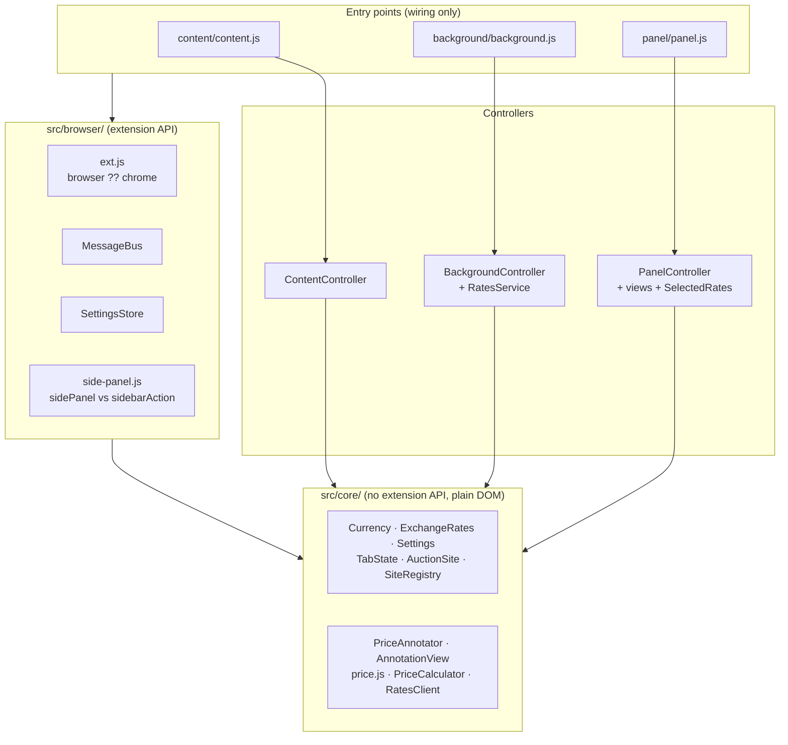
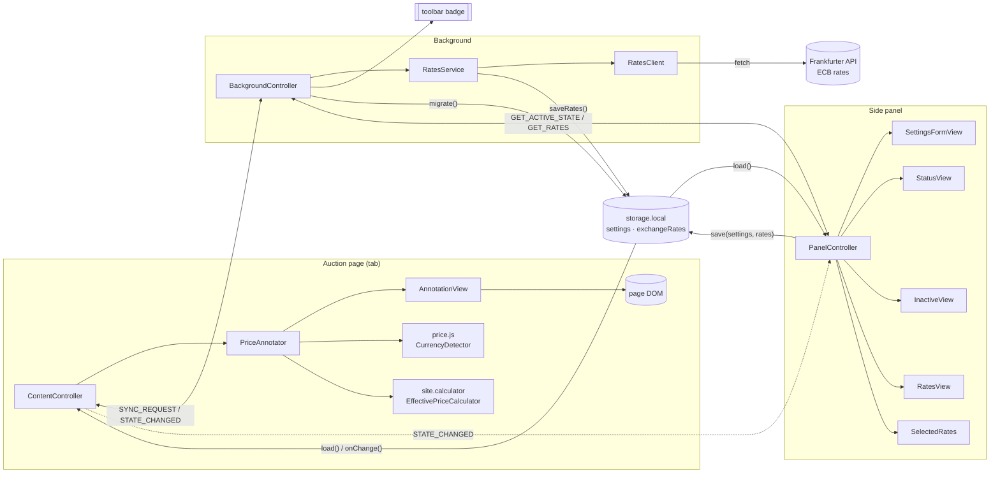
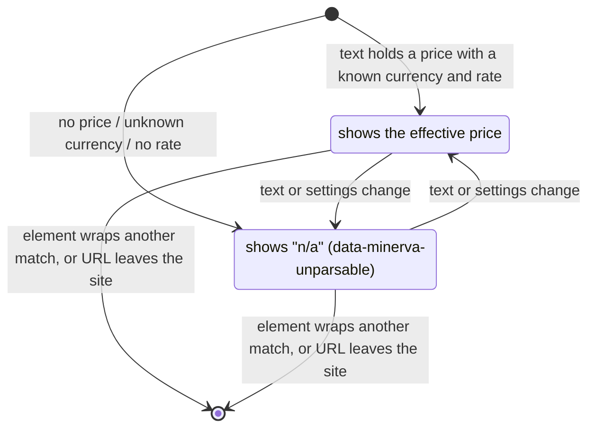
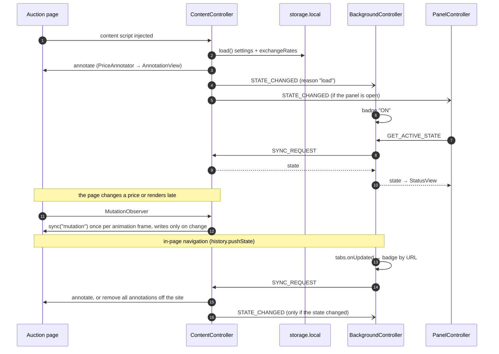
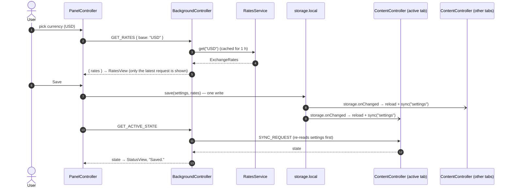
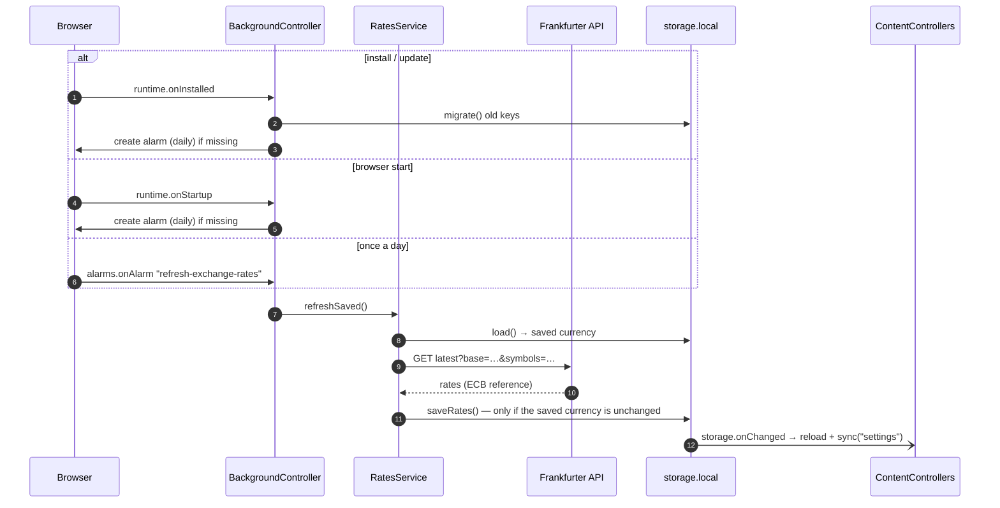
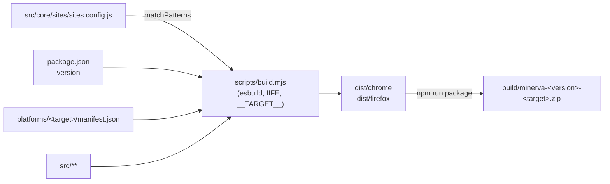

# Architecture

Minerva is a Manifest V3 WebExtension for Chrome and Firefox. It runs in three separate JavaScript contexts that only talk to each other through **runtime messages** and **`storage.local`**:

| Context | Entry point | Controller | Runs … |
| --- | --- | --- | --- |
| **Content script** | `src/content/content.js` | `ContentController` | in every tab on a configured auction site (injected by the manifest) |
| **Background** | `src/background/background.js` | `BackgroundController` | once per browser: Chrome service worker, Firefox event page |
| **Panel** | `src/panel/panel.js` (+ `panel.html`) | `PanelController` | while the side panel (Chrome) / sidebar (Firefox) is open |

Each entry point only *wires things up*: it creates its controller with the real browser objects (`window`/`document`, `ext`, `MessageBus`, `SettingsStore`) and calls `start()`. All behaviour lives in the controllers, which get every dependency through their constructor and are therefore tested with jsdom and fakes (`test/*-controller.test.mjs`).

## Layers



| Layer | Rule |
| --- | --- |
| `src/core/` | Never touches an extension API; works on plain strings and a plain `Document`. Unit tested with jsdom. |
| `src/browser/` | The only code using `chrome.*` / `browser.*`. Classes take `ext` as constructor argument, so they are testable with a fake. `ext.js` reads the build constant `__TARGET__` and is therefore only imported by entry points. |
| Controllers | Behaviour of one context; everything injected. |
| Entry points | Create the controller with the real objects. |
| `platforms/<target>/manifest.json` | The only other place where Chrome and Firefox differ. |

## Components and dependencies



### Source layout

```
src/
  core/        browser-agnostic logic
    config.js      plugin-wide constants
    settings/      Settings (ranges, validation of the panel settings)
    pricing/       PriceCalculator (per site), EffectivePriceCalculator (the default)
    rates/         ExchangeRates (rates for one base, conversion), RatesClient (Frankfurter / ECB)
    currency/      Currency (the supported currencies: code, symbol, tokens),
                   CurrencyDetector (finds the currency next to a price)
    price.js       price parsing, conversion, re-formatting
    annotation/    PriceAnnotator (reads and prices the elements),
                   AnnotationView (inserts/updates the sibling, idempotent)
    sites/         AuctionSite, SiteRegistry, sites.config.js (the targeted sites),
                   url-matcher.js (glob matching for URLs)
    messages.js    message types
    state/         TabState (what the extension does in a tab: active, counts, price currencies)
  browser/     the thin browser abstraction (API alias, messaging, settings storage,
               side panel vs. sidebar)
  background/  background script / service worker (BackgroundController, RatesService + wiring)
  content/     content script (ContentController + wiring) + the annotation stylesheet
  panel/       side panel UI (Bootstrap): PanelController, views/, SelectedRates + wiring
platforms/
  chrome/manifest.json     MV3 + `side_panel`, service worker background
  firefox/manifest.json    MV3 + `sidebar_action`, event page background
scripts/       build, packaging, icon generation
test/          node:test + jsdom: core units, browser layer and controllers (fakes in test/support/)
icons/         base.png + the PNGs generated from it (npm run icons)
```

### Controllers and their dependencies

| Controller | Constructor dependencies | Responsibilities |
| --- | --- | --- |
| `ContentController` | `window`, `bus`, `store`, `sites` (default `SITES`), `annotator` (default `PriceAnnotator`) | Load settings and rates, annotate the page, re-sync on navigation/DOM/settings changes, answer `SYNC_REQUEST`, report `STATE_CHANGED` |
| `BackgroundController` | `ext`, `bus`, `store`, `rates` (`RatesService`), `sites` | Toolbar badge, forward `SYNC_REQUEST` on navigation, answer `GET_ACTIVE_STATE` and `GET_RATES`, settings migration, rates refresh schedule |
| `PanelController` | `document`, `tabs`, `bus`, `store` | Show and save settings, show rates of the selected currency, show the active tab's status |

| Helper | Owned by | Purpose |
| --- | --- | --- |
| `RatesService` | Background | The only user of `RatesClient`; one-hour cache for the panel's requests, refreshes the saved rates |
| `SelectedRates` | Panel | Rates of the currency picked in the panel; a newer request supersedes older ones |
| `PriceAnnotator` / `AnnotationView` | Content | *What* to show (wrapper rule, pricing) / the only class writing to the page, only on change |
| `MessageBus` | all | `on(type, handler)` dispatch; returns `true` for async answers so the channel stays open |
| `SettingsStore` | all | `load()`, `save(settings, rates)` in one write, `saveRates()`, `onChange()`, `migrate()` |

## HTML components

### Side panel (`src/panel/panel.html`)

The panel is a single Bootstrap page shared by both browsers. Its DOM is only touched through three view classes:

| Element (`id`) | Content | View | User events → controller |
| --- | --- | --- | --- |
| `#settings` (form) | the settings form, *Save* button | `SettingsFormView` | `submit` → `PanelController.save()` |
| `#currency` (select) | options built from `Currency.CODES` | `SettingsFormView` | `change` → `PanelController.selectCurrency()` |
| `#auction-premium` (input) | premium in %, `min`/`max` from `Settings.RANGES` | `SettingsFormView` | `input` → clears the invalid marker |
| `#shipment` (input) | shipping cost, `min` from `Settings.RANGES` | `SettingsFormView` | `input` → clears the invalid marker |
| `#shipment-currency` | the selected currency next to the shipment | `SettingsFormView` | – |
| `#saved` | "Saved." note, hidden after 2 s | `SettingsFormView` | – |
| `#inactive` | Minerva saying "?", "No auction or platform active"; shown instead of `#settings` while the active tab is inactive (the form stays hidden until the state is known) | `InactiveView` | – |
| `#status` (badge) | "3 prices updated, 1 n/a" / "inactive" | `StatusView` | – |
| `#rates` (table body), `#rates-info` | "1 GBP = 1.16 EUR" rows, source date / "Loading…" / error | `RatesView` | – |

### Injected annotation (content script)

For every price element on a configured site, `AnnotationView` inserts one sibling right after it:

```html
<span class="current-bid">USD 1.359</span>
<span class="minerva-effective-price" aria-live="polite" data-minerva-source="USD 1.359">EUR 779,50</span>
```

| Part | Meaning |
| --- | --- |
| same tag as the price element | flows like the price itself |
| `class="minerva-effective-price"` | `ANNOTATION_CLASS`; styled by `content.css` as a speech bubble with Minerva (`::before`) and its tail (`::after`), so the DOM stays one element; never read back as a price |
| `data-minerva-source` | the price text the result was computed from |
| `data-minerva-unparsable` | present while the annotation shows `n/a` (greyed out) |



## Messages

Four message types, defined in `src/core/messages.js` and sent through `MessageBus`:

| Type | From → to | Payload | Answer | Sent when |
| --- | --- | --- | --- | --- |
| `SYNC_REQUEST` | background → content (`tabs.sendMessage`) | – | `{ url, active, annotated, unparsable, currencies }` after re-reading the settings and syncing | a tab navigates (`tabs.onUpdated`), the panel asks for the active tab's state |
| `STATE_CHANGED` | content → background + panel | `{ url, active, annotated, unparsable, currencies, reason }` | – | a sync changed the tab's `TabState` |
| `GET_ACTIVE_STATE` | panel → background | – | the active tab's state (from its content script, or judged by URL without one) | panel opens, after Save, on tab switches/navigation, on `STATE_CHANGED` |
| `GET_RATES` | panel → background | `{ base }` | `{ rates }` (`ExchangeRates#toJSON()`) or `{ error }` | panel opens, a currency is picked |

Class instances do not survive messaging (structured clone): senders use `toJSON()`, receivers rebuild with `TabState.from()` / `ExchangeRates.fromJSON()`.

## Storage

Everything is stored in `storage.local` through `SettingsStore`; there is no message for settings, storage is the channel.

| Key | Value | Written by | Read by |
| --- | --- | --- | --- |
| `settings` | `{ auctionPremium, shipment, currency }` (`Settings#toJSON()`) | panel on Save | content script, panel |
| `exchangeRates` | `{ base, date, rates }` (`ExchangeRates#toJSON()`; `1 base = rates[code] code`) | panel on Save (with the settings, one write), background on refresh | content script |

Rates saved for another base than the saved currency are ignored, so only prices already in that currency are converted until matching rates exist. The one-key-per-setting layout of older versions (`settings.auctionPremium`, …) is converted once by `SettingsStore.migrate()`.

## Lifecycles

### Events per context

| Context | Event | Reaction |
| --- | --- | --- |
| Content | script injected (`document_idle`) | `start()`: load settings/rates, register listeners, `sync("load")`, observe the DOM |
| Content | `MutationObserver` (`childList`, `characterData`, whole document) | one `sync("mutation")` per animation frame |
| Content | `popstate`, `hashchange` | `sync("popstate")` / `sync("hashchange")` |
| Content | `storage.onChanged` (`settings`, `exchangeRates`) | reload settings/rates, `sync("settings")` |
| Content | `SYNC_REQUEST` | reload settings/rates, `sync("request")`, answer the state |
| Background | `runtime.onInstalled` | migrate old settings, schedule the daily alarm, refresh the saved rates |
| Background | `runtime.onStartup` | schedule the alarm if missing (Firefox drops alarms on restart), refresh the saved rates |
| Background | `alarms.onAlarm` (`refresh-exchange-rates`, daily) | refresh the saved rates |
| Background | `tabs.onUpdated` (`url` changed or `status: complete`) | badge by URL, `SYNC_REQUEST` to the tab |
| Background | `STATE_CHANGED` | badge by the reported state |
| Background | `GET_ACTIVE_STATE`, `GET_RATES` | answer (see [Messages](#messages)) |
| Background | toolbar button | Chrome: opens the side panel natively; Firefox: `action.onClicked` toggles the sidebar |
| Panel | panel opens | show saved settings, load rates, ask for the active tab's state |
| Panel | `#currency` `change` | show the currency next to the shipment, load its rates |
| Panel | `#settings` `submit` | validate, save settings + rates, refresh the status |
| Panel | `STATE_CHANGED`, `tabs.onActivated`, `tabs.onUpdated` | refresh the status |

### Page load and navigation



### Changing the settings in the panel



### Exchange rate refresh



## Build time

The manifests are generated from `platforms/<target>/manifest.json`: `scripts/build.mjs` replaces `$VERSION` (from `package.json`) and `$CONTENT_MATCHES` (from `SITES.matchPatterns()`), so the configured sites decide where the content script is injected.


